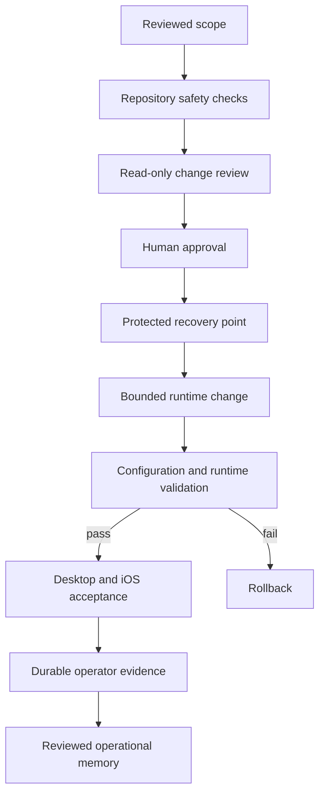
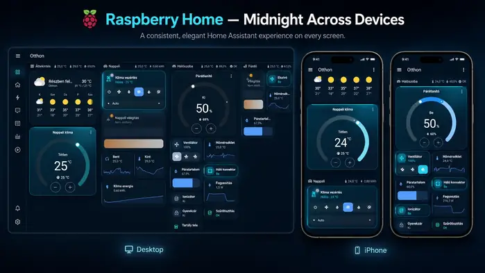

[← Developer profile](https://github.com/Charles-drZ)

# Raspberry Home — Versioned Home Assistant & Safe Operations Case Study

Raspberry Home is a privacy-aware homelab project showing how I turned a working Raspberry Pi 5 and Home Assistant environment into a versioned, reviewable, rollback-aware, and cross-client validated platform.

> **This case study demonstrates controlled technical delivery, runtime validation, and user-facing Home Assistant work without publishing the private configuration or a reusable deployment package.**

## At a glance

**Runtime:** Raspberry Pi 5 with Docker and Home Assistant  
**Product surface:** Separate responsive Home Assistant dashboard  
**Client validation:** Desktop browser and iOS Companion App  
**Operations:** Reviewed change, backup, validation, rollback, exact reapply, and explicit restart boundaries  
**Quality controls:** GitHub Actions, repository safety checks, runtime smoke, and user acceptance  
**Release state:** Production-validated Midnight Signature Skin v2 and Graphite theme rollout  
**Public material:** Engineering decisions, privacy-reviewed outcomes, and non-deployable diagrams

## What this proves

- I can inspect a real running system and separate runtime truth from outdated documentation.
- I can version selected configuration without turning Git into an unsafe copy of the live environment.
- I can design production changes around review, backup, validation, rollback, exact reapply, and explicit operational boundaries.
- I can build a responsive Home Assistant UI and verify it across desktop and iOS clients.
- I can diagnose client-specific and state-specific visual defects, correct them, and repeat the acceptance cycle.
- I can publish credible engineering evidence without exposing household, network, credential, device, or implementation details.

## What I built

- A separate, version-controlled Home Assistant dashboard that preserves the existing default Overview.
- A responsive room-oriented interface built from native Home Assistant components.
- Midnight and Graphite visual systems with distinct action, status, sensor, control, hero, active, idle, off, warning, and unavailable states.
- A controlled delivery workflow with reviewed source boundaries, backup, configuration validation, rollback, exact reapply, and explicit restart decisions.
- A commit-bound operator workflow for read-only planning, approved deployment, runtime smoke checks, durable evidence, and recovery.
- GitHub Actions checks for repository safety and change quality.
- A reviewed documentation flow for decisions, runtime evidence, and future maintenance.

## Verified outcome

The Midnight v2 rollout was validated on the real Raspberry Pi-hosted Home Assistant environment:

- pre-change and post-change configuration checks passed;
- reviewed dashboard and theme sources matched the deployed state;
- Home Assistant returned to service successfully after the approved restart;
- application and dashboard availability checks passed;
- no relevant startup or configuration errors were found;
- desktop browser acceptance passed;
- iOS Companion App acceptance passed;
- an idle-versus-active hero-state problem was corrected and revalidated;
- rollback restored the previous reviewed runtime state exactly;
- reapply restored the final Midnight v2 runtime state exactly;
- unrelated theme variants remained unchanged through the final delivery cycle.

The Graphite rollout then exercised the hardened operator workflow against the same production environment:

- an exact reviewed commit was checked out in a detached production worktree;
- status and deployment planning passed before any write;
- the previous runtime theme was backed up before replacement;
- the reviewed Graphite source was applied with configuration validation;
- Home Assistant restart and HTTP smoke checks passed;
- durable operator evidence recorded the deployed commit, previous and current hashes, backup, validation, restart, and recovery availability;
- desktop and iOS visual acceptance passed on the resulting production state.

## Delivery model

The diagram communicates responsibility and evidence flow only. The live topology, configuration, paths, scripts, mappings, identifiers, and access details remain private.

## Dashboard and UX work

The interface is organised around everyday user intent rather than integrations or vendors. It provides environmental context, common lighting and climate controls, room-level state, touch-friendly actions, and maintenance information.

The layout uses the platform's responsive behaviour so the same information hierarchy works across a desktop browser and a mobile companion app. The existing Overview remains available as a fallback rather than being replaced.

Midnight v2 adds a recognisable but restrained visual character: deep surfaces, cool cyan focus, clear state rails, differentiated hero intensity, and readable mobile labels. Graphite keeps the same component and state hierarchy while shifting the surrounding presentation toward a more neutral, monochrome surface system. Active controls remain prominent, while idle, off, warning, and unavailable states stay visibly distinct without turning every card into neon.

## Cross-client lesson

Desktop validation alone was not enough. The iOS Companion App exposed differences in rendering and label pressure that were not obvious in a wide browser layout. Later acceptance also showed that a climate hero could look active while reporting an idle action state.

I treated both findings as product defects rather than cosmetic exceptions: the visual contract was corrected, the reviewed changes were redeployed through the controlled operations flow, and acceptance was repeated on the real clients.

The Graphite rollout repeated the same cross-client gate after deployment rather than assuming that a successful configuration check proved the user-facing result.

This demonstrates the value of validating the actual client experience instead of treating a successful configuration check or browser view as complete proof.

## Technology

Raspberry Pi 5 · Docker · Home Assistant · YAML · Bash · Git · GitHub pull requests · GitHub Actions · GitHub Issues · Markdown-based operational documentation

The validated themes keep native Home Assistant cards as the product surface and use a bounded theme-layer styling dependency rather than custom dashboard cards or a separate frontend. Implementation details and reusable configuration remain private.

## Visual evidence

The visual set combines an owner-approved Midnight presentation composite with privacy-reviewed production captures from the Graphite rollout. None of the published visuals exposes an IP address, hostname, account name, entity identifier, device identifier, credential, notification content, access path, or precise location.

### Graphite production dashboard — desktop

  

This raw production capture shows the deployed Graphite visual system across the full desktop information hierarchy after configuration validation, restart, runtime smoke, and visual acceptance. The dashboard implementation, entity mapping, and operational configuration remain private.

### Graphite mobile overview and climate hierarchy

  

The mobile overview preserves the same hierarchy while keeping the climate hero, active controls, state rails, labels, and unavailable states readable at phone width.

### Graphite state-aware bedroom composition

  

This view demonstrates the production Graphite state model across a hero control, active action tiles, read-only sensors, energy feedback, off state, and explicit maintenance status.

### Midnight across devices

  

This presentation composite shows the production-validated Raspberry Home Midnight visual system across desktop and iPhone layouts. It is based on privacy-reviewed production captures rather than presented as a raw runtime screenshot; the dashboard implementation, entity mapping, and operational configuration remain private.

### Midnight climate and control hierarchy

  

The climate hero remains readable and visually important while its idle state is quieter than the active control card below it. This is the final state after the idle-versus-active polish and mobile label review.

### Midnight state-aware bedroom composition

  

This view demonstrates the same mobile information hierarchy across a hero control, action tiles, read-only sensors, energy feedback, and explicit maintenance status.

See the [visual publication plan](assets/SCREENSHOT_PLAN.md) for the capture roles, household-privacy rules, and pre-publication checklist.

## Public boundary

The project is deliberately split into two layers:

- a private operational repository containing the reviewed implementation, real environment knowledge, evidence, and recovery procedures;
- this public case study containing only independently written explanations, non-deployable diagrams, privacy-reviewed visuals, and verified outcomes.

This repository contains no real IP addresses, locations, hostnames, entity identifiers, device IDs, credentials, remote-access details, private keys, backup archives, raw logs, copied production topology, deploy mappings, executable operations scripts, or reusable configuration examples.

**This is a portfolio case study, not a deployment package.**

## Explore the case study

- [Home Assistant UI and UX decisions](docs/home-assistant-ui-architecture.md)
- [Controlled change and recovery model](docs/safe-change-workflow.md)
- [Sanitized validation evidence](docs/validation-evidence.md)
- [Architecture and responsibility boundaries](docs/architecture.md)
- [Security and privacy principles](docs/security-principles.md)
- [Troubleshooting method](docs/troubleshooting-method.md)
- [Visual publication plan](assets/SCREENSHOT_PLAN.md)
- [Changelog](CHANGELOG.md)

## Related work

- [Developer profile](https://github.com/Charles-drZ/Charles-drZ)
- [GlassBox product case study](https://github.com/Charles-drZ/glassbox-showcase)
- [Development workflow case study](https://github.com/Charles-drZ/glassbox-development-workflow)
- [Automation workflow case study](https://github.com/Charles-drZ/automation-workflow-showcase)
