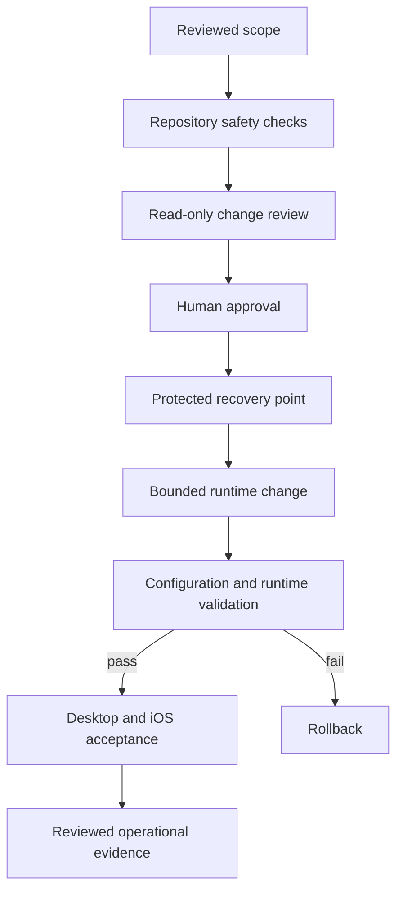

[← Developer profile](https://github.com/Charles-drZ)

# Raspberry Home — Versioned Home Assistant & Safe Operations Case Study

Raspberry Home is a privacy-aware homelab project showing how I turned a working Raspberry Pi 5 and Home Assistant environment into a versioned, reviewable, rollback-aware, and cross-client validated platform.

> **This case study demonstrates controlled technical delivery, runtime validation, and user-facing Home Assistant work without publishing the private configuration or a reusable deployment package.**

## At a glance

**Runtime:** Raspberry Pi 5 with Docker and Home Assistant  
**Product surface:** Separate responsive Home Assistant dashboard  
**Client validation:** Desktop browser and iOS Companion App  
**Operations:** Reviewed change, backup, validation, rollback, and explicit restart boundaries  
**Quality controls:** GitHub Actions, repository safety checks, runtime smoke, and user acceptance  
**Release state:** Production-validated v1; additional themes and visual refinements continue privately  
**Public material:** Engineering decisions, privacy-reviewed outcomes, and non-deployable diagrams

## What this proves

- I can inspect a real running system and separate runtime truth from outdated documentation.
- I can version selected configuration without turning Git into an unsafe copy of the live environment.
- I can design production changes around review, backup, validation, rollback, and explicit operational boundaries.
- I can build a responsive Home Assistant UI and verify it across desktop and iOS clients.
- I can diagnose a client-specific visual defect, correct it, and repeat the acceptance cycle.
- I can publish credible engineering evidence without exposing household, network, credential, device, or implementation details.

## What I built

- A separate, version-controlled Home Assistant dashboard that preserves the existing default Overview.
- A responsive room-oriented interface built from native Home Assistant components.
- A dark visual system validated in both desktop browsers and the iOS Companion App.
- A controlled delivery workflow with reviewed source boundaries, backup, configuration validation, rollback, and explicit restart decisions.
- GitHub Actions checks for repository safety and change quality.
- A reviewed documentation flow for decisions, runtime evidence, and future maintenance.

## Verified outcome

The v1 rollout was validated on the real Raspberry Pi-hosted Home Assistant environment:

- pre-change and post-change configuration checks passed;
- reviewed dashboard and theme sources matched the deployed state;
- Home Assistant returned to service successfully after the approved restart;
- application and dashboard availability checks passed;
- no relevant startup or configuration errors were found;
- desktop browser acceptance passed;
- iOS Companion App acceptance passed;
- a cross-client visual inconsistency found during mobile testing was corrected and revalidated.

## Delivery model

The diagram communicates responsibility and evidence flow only. The live topology, configuration, paths, scripts, mappings, identifiers, and access details remain private.

## Dashboard and UX work

The interface is organised around everyday user intent rather than integrations or vendors. It provides environmental context, common lighting and climate controls, room-level state, touch-friendly actions, and maintenance information.

The layout uses the platform's responsive behaviour so the same information hierarchy works across a desktop browser and a mobile companion app. The existing Overview remains available as a fallback rather than being replaced.

## Cross-client lesson

Desktop validation alone was not enough. The first iOS pass exposed a theme-mode difference that produced inconsistent surfaces. I corrected the visual definitions, deployed the reviewed change through the same controlled workflow, and repeated desktop and iOS acceptance.

This demonstrates the value of validating the actual client experience instead of treating a successful configuration check or browser view as complete proof.

## Technology

Raspberry Pi 5 · Docker · Home Assistant · YAML · Bash · Git · GitHub pull requests · GitHub Actions · GitHub Issues · Markdown-based operational documentation

The validated v1 uses native Home Assistant UI components. No custom HTML frontend, custom JavaScript card, or third-party styling framework is claimed.

## Visual evidence

Privacy-reviewed visuals will be added incrementally as the private dashboard and additional themes stabilise:

- desktop dashboard overview;
- iOS Companion App view;
- selected theme variants;
- a safe presentation of the cross-client correction.

Every image must exclude real entity identifiers, locations, household details, notifications, accounts, diagnostics, and network information. Product screenshots are evidence, not configuration exports.

See the [visual publication plan](assets/SCREENSHOT_PLAN.md) for the planned capture set, household-privacy rules, and pre-publication checklist.

## Visual preview

`assets/visuals/` is reserved for future, privacy-reviewed screenshots so visual evidence can be added without redesigning the case study. No screenshots are included yet.

Privacy boundary: every future image must exclude household, account, location, network, device, notification, diagnostic, and configuration details, using approved or synthetic content where needed.

Planned images:

- [ ] `assets/visuals/raspberry-desktop-dashboard.png`
- [ ] `assets/visuals/raspberry-ios-companion.png`
- [ ] `assets/visuals/raspberry-theme-variant.png`
- [ ] `assets/visuals/raspberry-cross-client-consistency.png`

## Public boundary

The project is deliberately split into two layers:

- a private operational repository containing the reviewed implementation, real environment knowledge, evidence, and recovery procedures;
- this public case study containing only independently written explanations, non-deployable diagrams, and verified outcomes.

This repository contains no real IP addresses, locations, hostnames, entity identifiers, device IDs, credentials, remote-access details, private keys, backup archives, raw logs, copied production topology, deploy mappings, executable operations scripts, or reusable configuration examples.

**This is a portfolio case study, not a deployment package.**

## Explore the case study

- [Home Assistant UI and UX decisions](docs/home-assistant-ui-architecture.md)
- [Controlled change and recovery model](docs/safe-change-workflow.md)
- [Sanitized validation evidence](docs/validation-evidence.md)
- [Architecture and responsibility boundaries](docs/architecture.md)
- [Security and privacy principles](docs/security-principles.md)
- [Troubleshooting method](docs/troubleshooting-method.md)
- [Visual publication plan](assets/SCREENSHOT_PLAN.md)
- [Changelog](CHANGELOG.md)

## Related work

- [Developer profile](https://github.com/Charles-drZ/Charles-drZ)
- [GlassBox product case study](https://github.com/Charles-drZ/glassbox-showcase)
- [Development workflow case study](https://github.com/Charles-drZ/glassbox-development-workflow)
- [Automation workflow case study](https://github.com/Charles-drZ/automation-workflow-showcase)
