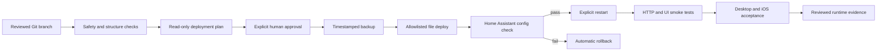

# Raspberry Home — Versioned Home Assistant & Safe Operations Case Study

Raspberry Home is a privacy-aware homelab project showing how I turned a working Raspberry Pi 5 and Home Assistant environment into a versioned, reviewable, rollback-safe, and cross-client validated platform.

> **This case study demonstrates that I can move beyond local configuration changes and build a controlled operational workflow with source boundaries, CI, backup, rollback, runtime evidence, and user acceptance.**

## At a glance

| Area | Current state |
| --- | --- |
| Runtime | Raspberry Pi 5 with Docker and Home Assistant |
| Product surface | Separate responsive Home Assistant dashboard |
| Client validation | Desktop browser and iOS Companion App |
| Operations | Guarded deploy, backup, config check, rollback, explicit restart |
| Quality controls | GitHub Actions, repository safety checks, synthetic workflow tests, runtime smoke |
| Release state | Production-validated v1; additional themes and visual refinements continue privately |
| Public material | Sanitized architecture, generic examples, and verified outcomes |

## What this proves

- I can inspect a real running system and separate runtime truth from outdated documentation.
- I can version selected configuration without turning Git into an unsafe copy of the live environment.
- I can design production changes around read-only planning, explicit approval, backup, validation, and rollback.
- I can build a responsive Home Assistant UI and verify it across desktop and iOS clients.
- I can diagnose a client-specific visual defect, correct it, and repeat the acceptance cycle.
- I can publish useful engineering evidence without exposing household, network, credential, or device details.

## What I built

- A separate version-controlled Home Assistant dashboard that leaves the existing default Overview untouched.
- A responsive room-oriented UI using native Home Assistant Sections, Tile, Thermostat, Humidifier, and Weather cards.
- A custom dark visual system that behaves consistently in desktop browsers and the iOS Companion App.
- An exact source-to-target deployment contract instead of copying an entire runtime configuration directory.
- A guarded configuration bootstrap with baseline verification.
- Timestamped backup, configuration validation, automatic rollback, and explicit restart boundaries.
- GitHub Actions checks for shell syntax, repository safety, dashboard structure, and synthetic apply/rollback behavior.
- A GitHub Issues and reviewed Markdown workflow for active work, runtime evidence, and durable operational memory.

## Verified outcome

The v1 rollout was validated on the real Raspberry Pi-hosted Home Assistant environment:

- pre-change and post-change configuration checks passed;
- reviewed dashboard and theme sources matched the deployed state;
- Home Assistant restarted and returned to service in approximately six seconds;
- the Home Assistant root and the new dashboard returned HTTP `200`;
- no relevant Lovelace, traceback, or configuration errors appeared after restart;
- desktop browser acceptance passed;
- iOS Companion App acceptance passed;
- a cross-client theme difference found during mobile testing was corrected and revalidated.

## Delivery architecture

The public diagram describes roles and controls. The live topology, addresses, paths, device identifiers, and access details remain private.

## Dashboard and UX work

The dashboard uses native Home Assistant components rather than adding frontend dependencies solely for appearance.

The v1 information architecture covers:

- environmental and weather overview;
- primary lighting and climate controls;
- room-level humidity and device state;
- touch-friendly frequently used actions;
- maintenance and utility information.

The interface is multi-column on desktop and naturally reflows for mobile use. The existing default Overview remains available as a fallback rather than being replaced.

## Cross-client lesson

The first desktop validation looked correct, while the iOS app requested a different theme mode and exposed fallback surfaces. The correction defined the critical visual variables consistently across root, light, and dark theme branches, followed by another exact deploy, configuration check, restart, and iOS acceptance pass.

This is a practical example of why browser success alone is not sufficient evidence for a multi-client UI.

## Technology

Raspberry Pi 5 · Docker · Home Assistant · YAML · Bash · Git · GitHub pull requests · GitHub Actions · GitHub Issues · Markdown / Obsidian-style durable documentation

The validated v1 uses native Home Assistant UI components. No custom HTML frontend, custom JavaScript card, Mushroom, card-mod, or similar dependency is claimed.

## Visual evidence

The case study is ready for visuals to be added incrementally as the private dashboard and additional themes stabilize.

Planned privacy-reviewed additions include:

- a desktop dashboard overview;
- an iOS Companion App view;
- selected theme variants;
- a safe before-and-after presentation of the cross-client correction.

Each image must be cropped, redrawn, blurred, renamed, or replaced with a synthetic mockup when necessary. No real entity ID, location, household detail, notification, account, or network information may be visible.

## Public boundary

The project is deliberately split into two layers:

- a private operational repository containing real environment knowledge and reviewed source configuration;
- this public showcase containing only sanitized architecture, generic examples, and verified outcomes.

This repository contains no real IP addresses, locations, hostnames, entity identifiers, device IDs, credentials, remote-access details, private keys, backup archives, raw logs, or copied production topology.

It is a portfolio case study, not a deployment package. Generic examples illustrate engineering principles but do not reproduce the private operational repository.

## Explore the case study

- [Home Assistant UI architecture](docs/home-assistant-ui-architecture.md)
- [Safe change and rollback workflow](docs/safe-change-workflow.md)
- [Sanitized validation evidence](docs/validation-evidence.md)
- [Architecture and service roles](docs/architecture.md)
- [Security and privacy principles](docs/security-principles.md)
- [Troubleshooting method](docs/troubleshooting-method.md)
- [Sanitized dashboard example](examples/dashboard.sanitized.yaml)
- [Cross-client dark theme example](examples/raspberry-home-theme.yaml)
- [Exact deployment map example](examples/deploy-map.example.tsv)
- [Generic site handover template](templates/site-handover-template.md)
- [Changelog](CHANGELOG.md)

## Related work

- [Developer profile](https://github.com/Charles-drZ/Charles-drZ)
- [GlassBox product case study](https://github.com/Charles-drZ/glassbox-showcase)
- [Development workflow case study](https://github.com/Charles-drZ/glassbox-development-workflow)
- [Automation workflow case study](https://github.com/Charles-drZ/automation-workflow-showcase)
