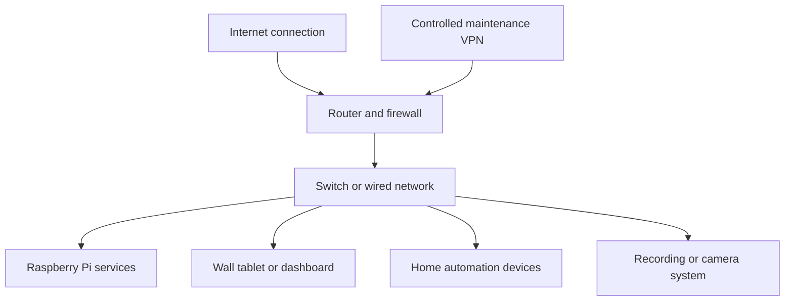

# Raspberry Home — Documentation Case Study

This repository is a sanitized documentation case study for a Raspberry Pi, Home Assistant, networking, and remote-maintenance lab. It demonstrates repeatable documentation and troubleshooting patterns; it does not describe a real installation.

## What this showcases

- Raspberry Pi and Home Assistant deployment thinking
- Pi-hole and local-network service considerations
- Router and access-point role separation
- Fixed-addressing principles without publishing an address plan
- Controlled remote-maintenance access
- Troubleshooting logs and repeatable handover checks
- Clear separation between technical documentation and credentials

## Documentation-first approach

The most useful operational knowledge is not a list of commands. It is a consistent way to record device roles, expected behavior, validation steps, access boundaries, and the outcome of an investigation.

The diagram is illustrative only. It contains no real topology, address, device, or access data.

## Contents

- [Architecture](docs/architecture.md)
- [Security principles](docs/security-principles.md)
- [Troubleshooting method](docs/troubleshooting-method.md)
- [Generic site handover template](templates/site-handover-template.md)

## Safety boundary

No real IP addresses, locations, customer information, hostnames, device identifiers, credentials, remote-access details, screenshots, or network diagrams are included.

This repository is a portfolio case study, not a deployment package.
