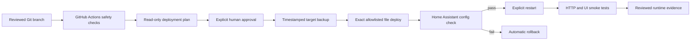

# Raspberry Home — Versioned Home Assistant & Safe Operations Case Study

A privacy-aware homelab case study showing how I turned a working Raspberry Pi 5 and Home Assistant installation into a versioned, reviewable and rollback-safe smart-home platform.

The project is deliberately split into two layers:

- a private operational repository containing real environment knowledge and reviewed configuration;
- this public showcase containing only sanitized architecture, reusable patterns and verified outcomes.

## What I built

- A separate, version-controlled Home Assistant dashboard that leaves the existing default Overview untouched.
- A responsive room-based UI built with native Home Assistant Sections, Tile, Thermostat, Humidifier and Weather cards.
- A custom dark theme that renders consistently in desktop browsers and the iOS Companion App.
- An exact source-to-target deployment contract instead of copying an entire runtime configuration directory.
- A guarded configuration bootstrap with SHA-256 baseline verification.
- Timestamped backup, config validation, automatic rollback and explicit restart boundaries.
- GitHub Actions checks for shell syntax, repository safety, dashboard structure and synthetic apply/rollback behaviour.
- A GitHub Issues and reviewed Markdown workflow for active work, runtime evidence and durable operational memory.

## Verified outcome

The production rollout was validated on a real Raspberry Pi-hosted Home Assistant instance:

- all pre-change and post-change configuration checks passed;
- dashboard and theme files matched their reviewed source hashes;
- Home Assistant restarted and became available within roughly six seconds;
- both the Home Assistant root and the new dashboard returned HTTP `200`;
- no relevant Lovelace, traceback or configuration errors appeared after restart;
- desktop browser and iOS Companion App acceptance both passed;
- a cross-client theme difference found during iOS testing was fixed and revalidated.

## Architecture

The live network topology, addresses, device identifiers and credentials remain private.

## Dashboard design

The dashboard uses native Home Assistant components rather than adding frontend dependencies solely for appearance.

- **Overview:** weather, indoor/outdoor conditions and primary climate control.
- **Living space:** lighting, climate and energy state.
- **Bedroom:** dehumidifier, fan, humidity, power and maintenance alerts.
- **Bathroom:** lighting, extraction and environmental state.
- **Kitchen and outdoor:** frequently used lighting controls.
- **Utility area:** water-heating and power information.

The UI is multi-column on desktop and naturally reflows for touch use on mobile.

## Cross-client theme lesson

Desktop and iOS clients can request different Home Assistant theme modes. The first mobile smoke exposed light-mode fallback surfaces even though the browser looked correct.

The final theme therefore defines critical background, card, text, header and sidebar values:

- at the theme root;
- under the `light` mode;
- under the `dark` mode.

This produces a consistent dark dashboard without custom JavaScript or card-mod.

## Technology used

- Raspberry Pi 5
- Docker
- Home Assistant
- YAML
- Bash
- Git and GitHub pull requests
- GitHub Actions
- GitHub Issues
- Markdown / Obsidian-style durable documentation

No custom HTML frontend, custom JavaScript card or card-mod dependency is claimed for this version.

## Repository contents

- [Home Assistant UI architecture](docs/home-assistant-ui-architecture.md)
- [Safe change and rollback workflow](docs/safe-change-workflow.md)
- [Sanitized validation evidence](docs/validation-evidence.md)
- [Architecture and service roles](docs/architecture.md)
- [Security and privacy principles](docs/security-principles.md)
- [Troubleshooting method](docs/troubleshooting-method.md)
- [Sanitized dashboard example](examples/dashboard.sanitized.yaml)
- [Cross-client dark theme example](examples/raspberry-home-theme.yaml)
- [Exact deployment map example](examples/deploy-map.example.tsv)
- [Generic site handover template](templates/site-handover-template.md)
- [Changelog](CHANGELOG.md)

## Safety boundary

This is a portfolio case study, not a deployment package.

It contains no real IP addresses, locations, hostnames, entity identifiers, device IDs, credentials, remote-access details, private keys, backup archives, raw logs or copied production topology.

Screenshots are published only after explicit sanitization review. The current version uses diagrams and sanitized configuration examples rather than exposing a live household dashboard.

## Related repositories

- [Public developer profile](https://github.com/Charles-drZ/Charles-drZ)
- [GlassBox product case study](https://github.com/Charles-drZ/glassbox-showcase)
- [GlassBox development workflow](https://github.com/Charles-drZ/glassbox-development-workflow)
- [Automation workflow case study](https://github.com/Charles-drZ/automation-workflow-showcase)
