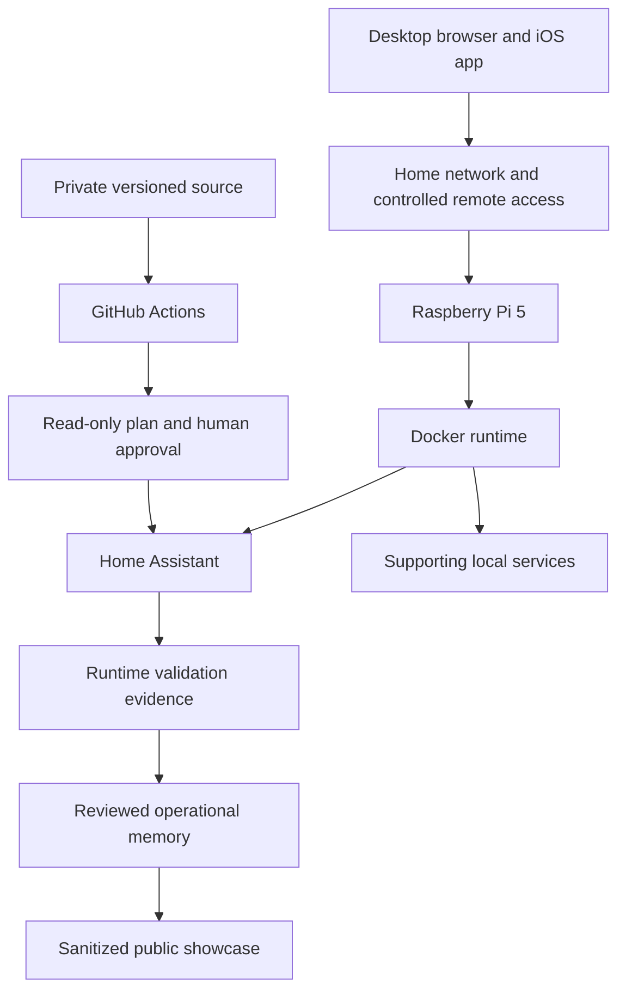
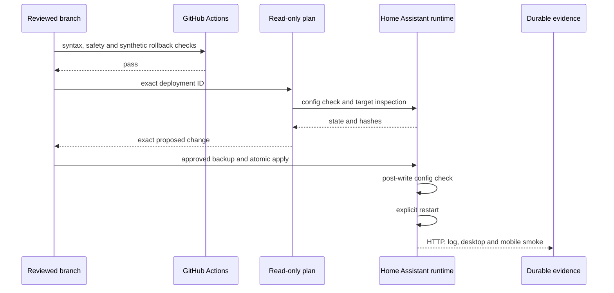

# Architecture

## System roles

The private environment uses a Raspberry Pi 5 as a small always-on platform for selected household services. This public repository describes roles and boundaries rather than copying the live topology.

## Responsibilities

### Raspberry Pi and Docker

- provide an always-on ARM64 runtime;
- isolate Home Assistant and supporting services;
- keep persistent Home Assistant data outside the container image;
- make restart state and service ownership observable.

### Home Assistant

- integrate household devices;
- expose the existing default Overview;
- load a separate versioned YAML dashboard;
- load a versioned theme;
- validate configuration before restart.

### Private repository

- store reviewed source files, not the entire runtime;
- track work through GitHub Issues;
- use pull requests as implementation evidence;
- store durable Markdown decisions and sanitized runtime evidence;
- reject credentials, databases, `.storage`, backups and raw runtime exports.

### Public showcase

- explain the architecture and engineering decisions;
- publish generic configuration examples;
- document verified outcomes;
- omit real addressing, entity IDs, hostnames, locations and access details.

## Configuration flow

## Design principles

- One primary owner for routing and address assignment.
- Local operation is validated before remote-maintenance concerns.
- Runtime truth is not inferred from an old document.
- Repository content is an allowlisted source set, not a live filesystem mirror.
- Every production change has a baseline, backup, validation and rollback path.
- Public material explains the engineering without exposing the environment.

The real device inventory, network plan and configuration values remain private.