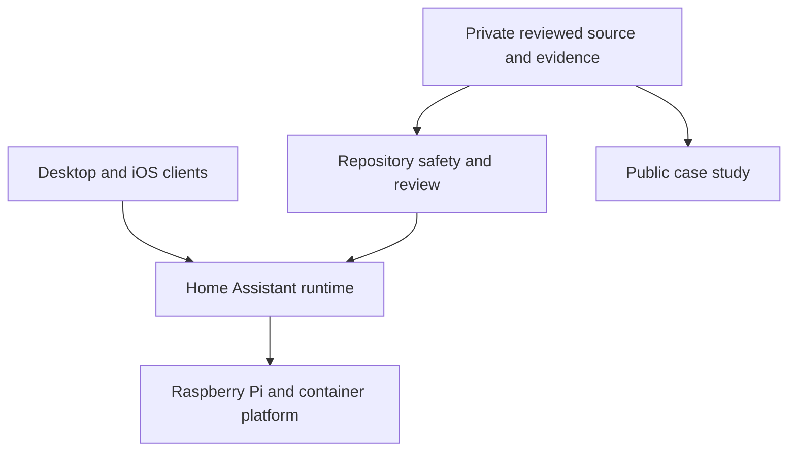
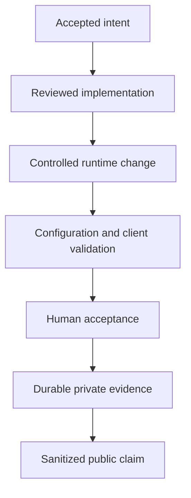

[← Raspberry Home case study](../README.md)

# Architecture and responsibility boundaries

## System view

The private environment uses a Raspberry Pi 5 as an always-on platform for Home Assistant and selected supporting services. This public case study describes responsibility boundaries rather than the live topology or configuration.

The diagram is intentionally non-operational. It does not disclose network roles, access paths, service placement, or deploy mechanics.

## Responsibility boundaries

### Runtime platform

- provides an observable, always-on service environment;
- separates application runtime from reviewed source material;
- supports controlled restart and recovery decisions.

### Home Assistant

- integrates the private household environment;
- retains the existing Overview as a fallback;
- exposes the separately developed dashboard and visual system;
- provides configuration and runtime signals used during validation.

### Private engineering repository

- contains the reviewed implementation and operational procedures;
- records accepted work, version history, and validation evidence;
- rejects credentials, runtime databases, backups, and unsafe exports;
- preserves recovery information outside the public portfolio.

### Public case study

- explains the problem, decisions, responsibilities, and verified outcomes;
- demonstrates UI, operations, testing, and documentation skills;
- contains no runnable deployment path or reusable configuration package;
- omits the real topology, identifiers, routines, and access model.

## Evidence flow

The public claim is derived from reviewed evidence, but the evidence package itself remains private.

## Design principles

- Runtime truth is not inferred from an old document or a successful build.
- Public Git is not a mirror of a live household environment.
- Production change, restart, recovery, and acceptance are separate responsibilities.
- Desktop success is not treated as mobile acceptance.
- Public material demonstrates engineering judgement without teaching the private implementation.

The real device inventory, service topology, configuration layout, and network plan remain private.

---

[← Return to Raspberry Home case study](../README.md)
