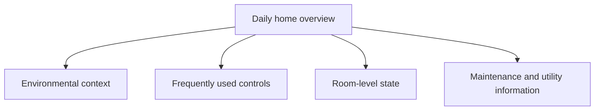

[← Raspberry Home case study](../README.md)

# Home Assistant UI and UX decisions

## Problem

A default smart-home dashboard is useful for discovery, but it is not automatically a clear, maintainable product surface. The project needed an interface that was intentionally structured, reviewable, responsive, and safe to change without exposing or replacing the private runtime configuration.

## Constraints

- The existing default Overview had to remain available.
- The public case study could not reveal real rooms, devices, identifiers, household routines, or configuration.
- Desktop and mobile clients both required acceptance testing.
- Visual improvements could not justify a separate frontend or unnecessary card dependencies.
- Every production change needed an evidence and recovery path.

## Product decision

I built a separate dashboard rather than redesigning the existing Overview in place. This kept a known fallback available and created a clear boundary between the established runtime surface and the new version-controlled experience.

The public repository documents the decision and outcome only. Registration details, file structure, mappings, theme values, and implementation remain private.

## Information architecture

The interface is organised around user intent rather than integrations or device vendors.

This structure reduces navigation cost and keeps related state and actions close together.

## Native component strategy

The validated product surface uses native Home Assistant cards. That choice preserves familiar interaction behaviour, lets the platform handle responsive layout, and keeps the dashboard independent from a custom frontend.

A bounded theme-layer styling dependency provides the component character. It does not replace the native cards, publish custom card code, or turn the public case study into a reusable dashboard package.

The public case study intentionally omits component configuration, entity mapping, selectors, design tokens, and generated theme sources. The value being demonstrated is the product and validation decision, not a reusable YAML implementation.

## Midnight Signature Skin v2

Midnight is the flagship visual direction for the dashboard. Its role is to provide a recognisable product character while preserving clear state semantics and platform-native behaviour.

The visual hierarchy distinguishes:

- hero controls from compact action and sensor cards;
- active controls from idle and off states;
- normal status from warning, unavailable, and maintenance states;
- interactive cards from read-only environmental information.

The final polish focused on a subtle but important defect: a climate hero reporting an idle action could still look as visually active as the control card beneath it. The state contract was refined so idle keeps the component identity but reduces halo, rail, surface, and shadow intensity.

This was validated on the real desktop dashboard and iOS Companion App rather than accepted from static source inspection alone.

## Responsive behaviour

The desktop view uses available width to show more context at once. On mobile, the same hierarchy reflows into a touch-friendly vertical experience without changing the underlying user model.

Mobile acceptance also drove shorter display names for frequently repeated environmental and utility cards. The change improved scanability without changing entity identity or underlying configuration.

Long diagnostic lists and rarely used maintenance controls are kept away from the primary daily surface.

## Cross-client theme lesson

The first desktop acceptance passed, but the iOS Companion App exposed inconsistent fallback surfaces because the two clients did not request visual modes identically.

I treated this as a real product defect rather than a cosmetic exception: the visual system was corrected, the reviewed change was redeployed through the controlled operations flow, and acceptance was repeated on both clients.

The later Midnight v2 cycle reinforced the same lesson through state-aware hero rendering and mobile label pressure. The exact theme variables and implementation are private. The public lesson is that multi-client UI work requires validation on the clients users actually operate.

## Failure visibility

The interface does not attempt to disguise unavailable device state. A missing or unhealthy integration should remain observable during maintenance rather than appearing falsely normal.

Warning and unavailable states are visually distinct from active accent states so operational problems do not look like successful user actions.

## Trade-offs

**Benefits**

- lower frontend dependency risk;
- familiar platform-native interactions;
- responsive behaviour across clients;
- clear fallback to the existing Overview;
- recognisable visual character without a separate frontend;
- smaller operational change surface.

**Costs**

- less visual freedom than a custom frontend;
- manual visual regression testing;
- a bounded styling dependency that must be validated with platform updates;
- continued maintenance as devices and client rendering evolve.

## Result

The Midnight v2 dashboard passed configuration validation, runtime availability checks, desktop acceptance, and real-device iOS acceptance. Client-specific and state-specific visual discrepancies were found, corrected, and revalidated.

The release also passed a controlled rollback and exact reapply cycle, proving that the visual delivery had a verified recovery path rather than only a successful forward deployment.

No configuration snippet, theme palette, entity placeholder set, selector contract, or deployable dashboard example is published as part of this result.

---

[← Return to Raspberry Home case study](../README.md)
