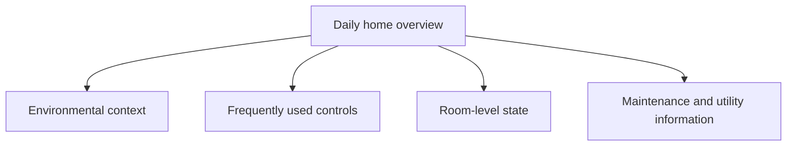

[← Raspberry Home case study](../README.md)

# Home Assistant UI and UX decisions

## Problem

A default smart-home dashboard is useful for discovery, but it is not automatically a clear, maintainable product surface. The project needed an interface that was intentionally structured, reviewable, responsive, and safe to change without exposing or replacing the private runtime configuration.

## Constraints

- The existing default Overview had to remain available.
- The public case study could not reveal real rooms, devices, identifiers, household routines, or configuration.
- Desktop and mobile clients both required acceptance testing.
- Visual improvements could not justify unnecessary frontend dependencies.
- Every production change needed an evidence and recovery path.

## Product decision

I built a separate dashboard rather than redesigning the existing Overview in place. This kept a known fallback available and created a clear boundary between the established runtime surface and the new version-controlled experience.

The public repository documents the decision and outcome only. Registration details, file structure, mappings, theme values, and implementation remain private.

## Information architecture

The interface is organised around user intent rather than integrations or device vendors.

This structure reduces navigation cost and keeps related state and actions close together.

## Native component strategy

The validated v1 uses native Home Assistant components. That choice reduced dependency risk, preserved familiar interaction behaviour, and allowed the platform to handle responsive layout across desktop and mobile.

The public case study intentionally omits the component configuration and entity mapping. The value being demonstrated is the product and validation decision, not a reusable YAML implementation.

## Responsive behaviour

The desktop view uses available width to show more context at once. On mobile, the same hierarchy reflows into a touch-friendly vertical experience without changing the underlying user model.

Long diagnostic lists and rarely used maintenance controls are kept away from the primary daily surface.

## Cross-client theme lesson

The first desktop acceptance passed, but the iOS Companion App exposed inconsistent fallback surfaces because the two clients did not request visual modes identically.

I treated this as a real product defect rather than a cosmetic exception: the visual system was corrected, the reviewed change was redeployed through the controlled operations flow, and acceptance was repeated on both clients.

The exact theme variables and implementation are private. The public lesson is that multi-client UI work requires validation on the clients users actually operate.

## Failure visibility

The interface does not attempt to disguise unavailable device state. A missing or unhealthy integration should remain observable during maintenance rather than appearing falsely normal.

## Trade-offs

**Benefits**

- lower frontend dependency risk;
- familiar platform-native interactions;
- responsive behaviour across clients;
- clear fallback to the existing Overview;
- smaller operational change surface.

**Costs**

- less visual freedom than a custom frontend;
- manual visual regression testing;
- continued maintenance as devices and platform rendering evolve.

## Result

The dashboard passed configuration validation, runtime availability checks, desktop acceptance, and real-device iOS acceptance. A client-specific visual discrepancy was found, corrected, and revalidated.

No configuration snippet, theme palette, entity placeholder set, or deployable dashboard example is published as part of this result.

---

[← Return to Raspberry Home case study](../README.md)
