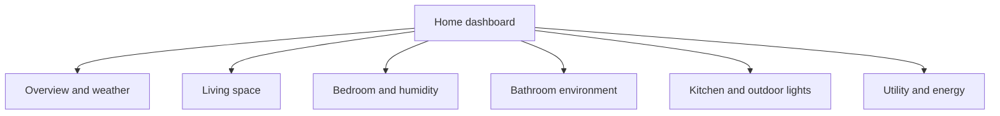

# Home Assistant UI architecture

## Problem

A default Home Assistant dashboard is useful for discovery, but it is not automatically a maintainable product surface. The project needed a dashboard that was:

- intentionally structured around everyday tasks;
- version controlled and reviewable;
- safe to deploy without replacing the full runtime configuration;
- usable on desktop and mobile;
- visually consistent without introducing unnecessary frontend dependencies;
- documented well enough to reproduce and maintain later.

## Constraints

- The existing storage-mode Overview had to remain untouched.
- Real entity IDs, device identifiers and household details could not appear in public material.
- The repository could not become a mirror of Home Assistant's `.storage` or database state.
- Production changes required backup, validation and rollback.
- No custom JavaScript or third-party visual card would be added unless native components could not meet the requirement.

## Decision: separate YAML dashboard

The implementation registers a separate YAML-mode dashboard and keeps the existing Overview available as a fallback.

```yaml
lovelace:
  dashboards:
    portfolio-home:
      mode: yaml
      filename: dashboards/portfolio-home.yaml
      title: Portfolio Home
      icon: mdi:home-automation
      show_in_sidebar: true
      require_admin: false
```

The public example uses generic names. Production names and entity mappings remain private.

## Information architecture

The dashboard is organised by user intent rather than by integration or vendor.



Each section has one clear responsibility. Frequently used actions are Tile cards; richer equipment uses native domain-specific cards.

## Native component strategy

The version uses:

- Sections view for responsive layout;
- Heading cards and entity badges for hierarchy;
- Tile cards for lights, switches, fans and sensor summaries;
- Thermostat card for primary climate control;
- Humidifier card for dehumidification;
- Weather forecast card for the overview;
- native Tile features for brightness, colour temperature, modes and short trends.

This avoided Mushroom, card-mod, layout-card and custom JavaScript dependencies in v1.

## Responsive behaviour

The Sections view handles the desktop-to-mobile transition:

- multiple sections can appear side by side on wide screens;
- cards naturally reflow into a touch-friendly vertical layout on mobile;
- controls remain close to their related state;
- long diagnostic entity lists are intentionally excluded.

## Theme architecture

A custom theme defines a dark blue-black surface, blue and teal accents, amber lighting state, green active switches and clear warning colours.

The first desktop validation passed, but iOS exposed an important client difference: the Companion App could request light mode and fall back to white control surfaces.

The final theme defines critical variables in three places:

1. theme root;
2. `modes.light`;
3. `modes.dark`.

```yaml
"Portfolio Home":
  primary-background-color: "#0B1118"
  card-background-color: "#151F2B"
  primary-text-color: "#F3F6FA"
  modes:
    light:
      primary-background-color: "#0B1118"
      card-background-color: "#151F2B"
    dark:
      primary-background-color: "#0B1118"
      card-background-color: "#151F2B"
```

This kept the dashboard visually consistent across desktop and iOS without custom CSS injection.

## Entity mapping boundary

Production entity mapping is documented privately because entity IDs may contain device, room or vendor details.

The public version uses semantic placeholders such as:

- `climate.living_room`;
- `sensor.indoor_temperature`;
- `light.kitchen`;
- `humidifier.bedroom`;
- `switch.water_heater`.

The architecture is reusable while the actual environment remains undisclosed.

## Failure and unavailable states

The dashboard intentionally relies on Home Assistant's native unavailable-state behaviour. No automation hides missing entities. This keeps failures visible during maintenance rather than presenting a falsely healthy UI.

## Trade-offs

### Benefits

- minimal frontend dependency risk;
- small and readable YAML surface;
- responsive behaviour supplied by Home Assistant;
- easier upgrades and rollback;
- clear separation from the default dashboard.

### Costs

- native cards provide less visual freedom than a custom frontend;
- visual regression testing remains manual;
- entity renames require configuration maintenance;
- Home Assistant frontend changes can alter card rendering over time.

## Result

The dashboard passed production configuration checks, restart and HTTP smoke tests, desktop acceptance and iOS acceptance. A mobile theme discrepancy was discovered through real-device testing, fixed and revalidated.

This is the kind of result the repository is intended to prove: not just YAML authoring, but architecture, controlled rollout, evidence and maintenance thinking.