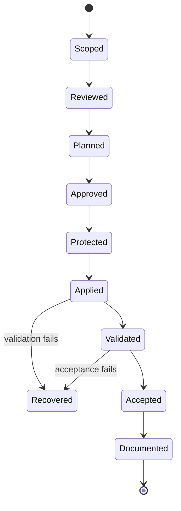

# Controlled change and recovery model

## Goal

A Home Assistant change should be reviewable before it reaches the running environment, observable after it is applied, and recoverable when validation fails.

The private repository contains the implementation and operational procedures. This public document explains the responsibility model and evidence expectations without publishing the deploy contract, scripts, paths, commands, hashes, or configuration mechanics.

## Sources of truth

- **Accepted work:** defines the intended outcome and validation boundary.
- **Reviewed version history:** proves what implementation was approved.
- **Running Home Assistant:** remains the authority for runtime behaviour.
- **Validation evidence:** records what was actually checked and observed.
- **Durable documentation:** preserves reviewed decisions and outcomes.

These responsibilities are kept separate so that a successful commit, workflow run, or configuration parse is not mistaken for complete runtime acceptance.

## Change lifecycle

## Review before change

Before a production change, the process establishes:

- the bounded scope;
- the intended runtime effect;
- the protected files or surfaces involved;
- the validation plan;
- the recovery expectation;
- the human approval boundary.

The planning stage is read-only. It is designed to reveal unintended scope before any runtime mutation occurs.

## Protected application

The private operational process applies only explicitly reviewed changes. It avoids broad filesystem copying and treats configuration registration, service restart, and recovery as separate decisions.

Implementation details are deliberately excluded from this repository. No public document provides a runnable command sequence or source-to-target mapping.

## Validation and recovery

A successful write is not acceptance. The workflow checks the relevant configuration and service behaviour before the change is considered complete.

When validation fails, the process returns the affected surface to its protected previous state and repeats the appropriate checks. Recovery material, exact file state, and operational commands remain private.

## Restart boundary

A restart temporarily affects a continuously running household service, so it is explicit rather than an invisible side effect of applying files.

After an approved restart, acceptance covers service availability, relevant error signals, the intended dashboard surface, and user flows on desktop and mobile clients.

## CI boundary

GitHub Actions can validate repository safety and static change quality without accessing the household runtime. Real runtime acceptance remains a separately approved operation performed against the private environment.

This prevents CI success from being presented as proof of behaviour it cannot observe.

## Public boundary

This repository does not publish:

- deploy mappings or approved runtime paths;
- scripts, commands, or confirmation contracts;
- hash baselines or locking mechanics;
- configuration bootstrap logic;
- backup locations or archive structure;
- live topology, identifiers, credentials, or logs;
- a complete implementation recipe.

## Why this matters

A dashboard change can look small while still affecting an always-on household service. The engineering value is not a particular script: it is the discipline of separating scope, approval, recovery, runtime evidence, and user acceptance.
