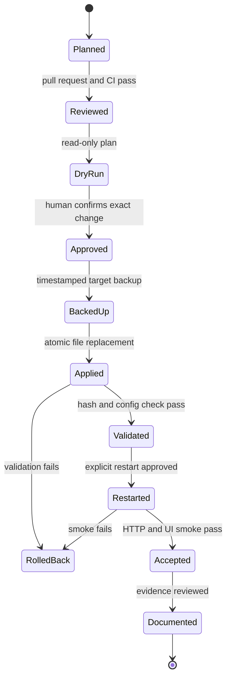

# Safe change and rollback workflow

## Goal

The deployment process must make a Home Assistant change reviewable before it becomes a runtime change, and recoverable if validation fails.

The repository is not a copy of the live `/config` directory. It contains only explicitly approved source files.

## Source-of-truth model

- **GitHub Issue:** accepted scope, safety boundary and validation plan.
- **Git branch and pull request:** reviewed implementation evidence.
- **Running Home Assistant:** runtime truth.
- **Sanitized Markdown evidence:** durable operational knowledge.
- **Public showcase:** reusable patterns only, never the live topology.

## Exact deployment contract

Deployment uses an explicit ID and one source-to-target mapping.

```text
portfolio-theme    home-assistant/themes/portfolio-home.yaml    themes/portfolio-home.yaml
portfolio-dashboard    home-assistant/dashboards/portfolio-home.yaml    dashboards/portfolio-home.yaml
```

Wildcards, recursive directory copies and full configuration replacement are rejected.

## Change lifecycle



## Read-only plan

The plan phase prints:

- deployment ID;
- reviewed source path;
- runtime target path;
- source SHA-256;
- whether the target is present or absent;
- current target SHA-256 when present;
- backup root;
- the exact apply command.

It also runs a baseline Home Assistant configuration check. It performs no file write, backup, reload or restart.

## Apply safeguards

An apply requires:

- an exact deployment ID;
- a matching explicit confirmation value;
- a clean, allowlisted source and target;
- a filesystem lock preventing concurrent changes;
- a timestamped backup directory;
- atomic write through a temporary target file;
- post-write SHA-256 verification;
- a post-write Home Assistant configuration check.

A validation failure triggers automatic rollback before any restart.

## Configuration bootstrap

Registering a separate YAML dashboard requires a bounded change to `configuration.yaml`.

The bootstrap is more restrictive than an ordinary file deploy:

- it checks an approved baseline SHA-256;
- it refuses to run when a top-level `lovelace:` key already exists;
- it adds one marked dashboard-registration block;
- it stores the complete previous configuration file in the backup;
- it performs config validation after the write;
- it does not restart unless explicitly requested.

## Rollback model

Two target states are supported:

- **previously present:** restore the backed-up file;
- **previously absent:** remove the newly created file.

The configuration bootstrap restores the entire previous `configuration.yaml` file.

Every rollback is followed by another Home Assistant configuration check.

## Restart boundary

A successful config check does not automatically justify a restart. Restart remains a separate, visible action because it temporarily affects the running service.

After restart the validation checks:

- container running state;
- Home Assistant HTTP availability;
- dashboard route availability;
- configuration validity;
- relevant startup errors;
- desktop and mobile user flows.

## CI model

GitHub Actions validates the repository without access to the private runtime:

- whitespace and diff integrity;
- shell syntax;
- secret and forbidden-path patterns;
- dashboard source structure;
- synthetic plan, apply and rollback;
- synthetic bootstrap apply and rollback.

Real runtime validation remains an explicitly approved local operation.

## Privacy boundary

The public repository does not contain:

- real target paths beyond generic examples;
- network addresses or hostnames;
- real entity IDs;
- credentials, tokens or keys;
- raw runtime logs;
- backup archives;
- the live configuration tree.

## Why this matters

A smart-home UI change can look small while still affecting a continuously running household service. Treating it as a controlled software release provides traceability, repeatability and a credible rollback path.